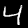
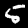
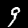

# 机器学习-人工神经网络
## 用Python实现的人工神经网络源代码，参考书《Python 神经网络编程》[英.Tariq Rashid]，对书中的代码做了一些中文注释和优化，增加操作数据集、采用实际图片测试等功能  

代码基于: Python3    

import    |
----------|
matplotlib|
numpy     |
scipy     |

**运行** :
```
python3 start.py
```

如果你用VSCode作为开发工具，可能会遇到这个error: 
```
[pylint] E1101:Module 'scipy.special' has no 'expit' member
```
请更改你的设置：
```
"python.linting.pylintArgs": ["--extension-pkg-whitelist=scipy"]
```
代码目录结构：  

目录|说明
--|--
`mnist_dataset/`|存放了包含100组数据的训练集，包含10组数据的测试集
`mnist_dataset/dataset.url`|存放了完整的mnist 数据集的下载地址：[mnist_train.csv](https://pjreddie.com/media/files/mnist_train.csv) ,[mnist_test.csv](https://pjreddie.com/media/files/mnist_test.csv)
`img/`|包含了从mnist数据集中导出的实例图片，有100多张，可以用来测试         . . .
`dataset.py`|操作数据集代码
`neural_network.py`|神经网络代码
`query.py`|用图像进行测试代码
`start.py`|训练并测试神经网络代码
  
**不用担心100组训练数据太少 ,运行代码你会发现只用100组测试数据就能达到【60%】的正确率！！**